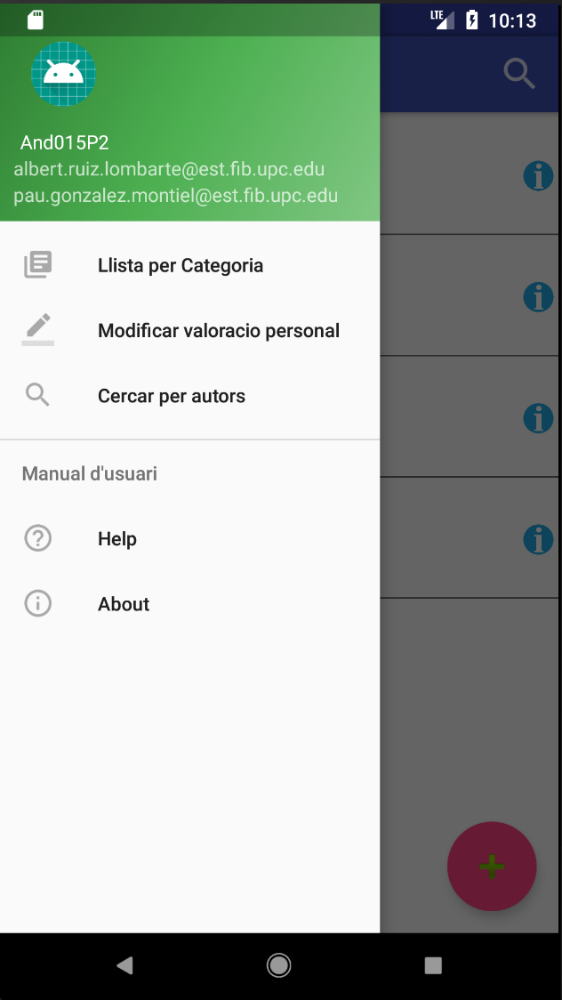
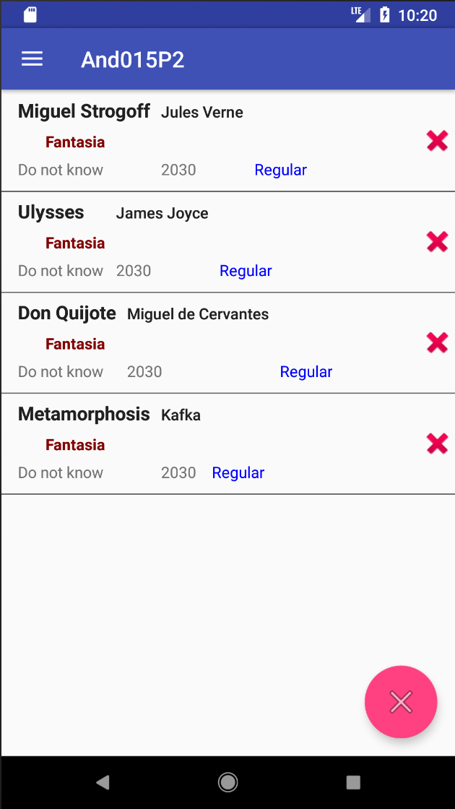

# BookDatabase
BookDatabase is an application for android that displays information about books from your local database. To achieve that, the application is designed with a clean architecture approach, separating the project into different layers: Views (with an MVP model), domain and data, which is designed with SQLite.

# BookDatabase views
## Main view

## Main menu

## Add book

## Search by author

## Sort by category

## Modify your personal review of a book

## Help

